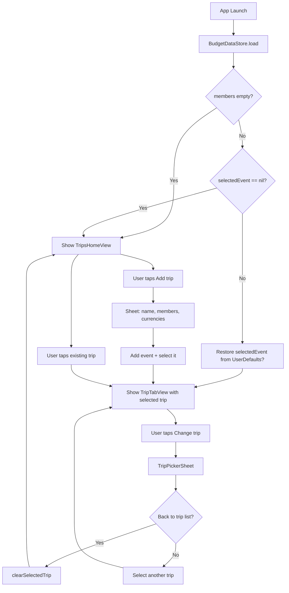
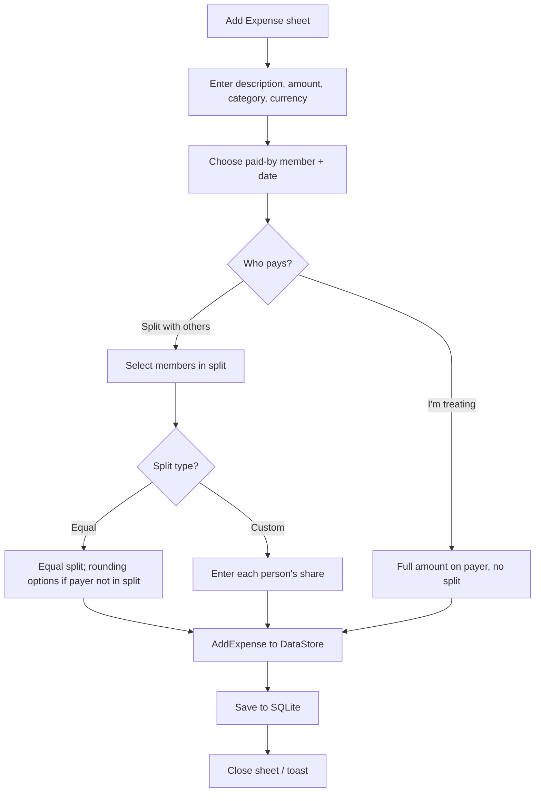
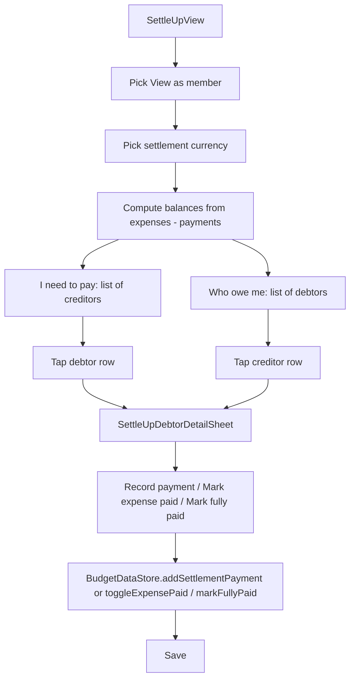
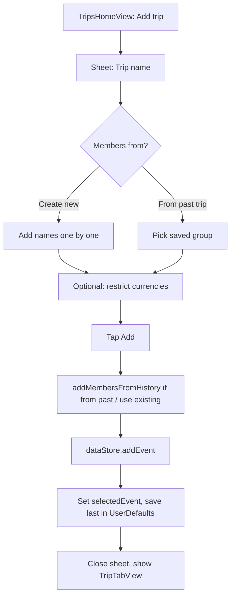
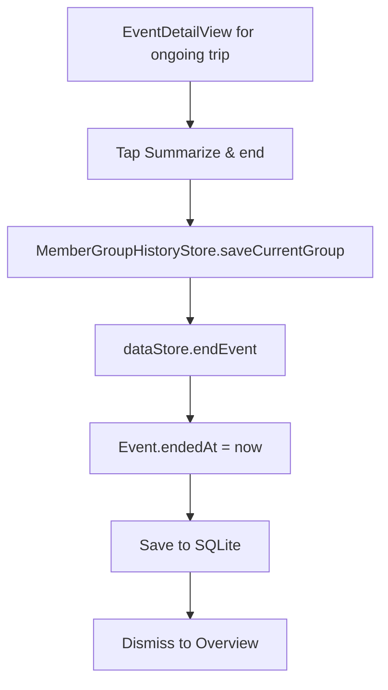
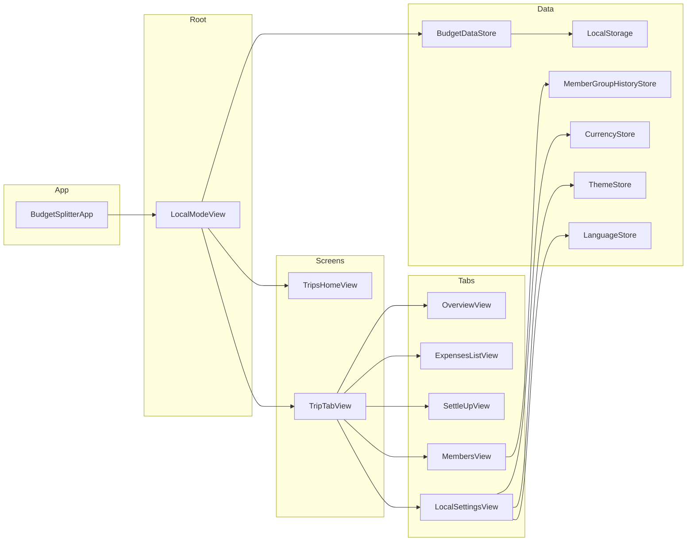

# Exsplitter (Budget Splitter) – Full Documentation

## 1. Overview

**Exsplitter** is an iOS app (SwiftUI) for splitting expenses among group members. It is **local-only**: all data is stored on the device in SQLite. There is no login, no cloud sync, and no backend dependency.

**Main capabilities:**
- Create **trips/events** (e.g. “Japan Trip”) and attach expenses and members to each trip.
- Add **expenses** with custom or equal splits, multiple currencies (JPY, MYR, SGD), and categories.
- Manage **members** per trip or globally; reuse past groups from **saved group history**.
- **Settle up**: see who owes whom, record payments, mark expenses as paid, handle change/partial payments.
- **Summary** and charts (by category, member, date); filter by members.
- **Settings**: language (EN / 中文 / 日本語), theme (Light/Dark/System), preferred currency and exchange rates.

---

## 2. Architecture

### 2.1 App entry and root flow

```
BudgetSplitterApp (@main)
  └── LocalModeView
        ├── [if no trip selected] TripsHomeView (trip list)
        │     └── Add trip → sheet: name + members (new or from saved group) + currencies
        └── [if trip selected] TripTabView (5 tabs)
              ├── Tab 0: OverviewView (stats, quick actions, recent activity)
              ├── Tab 1: ExpensesListView (filter, add expense)
              ├── Tab 2: SettleUpView (who owes whom, record payments)
              ├── Tab 3: MembersView (add/remove, saved groups, reset)
              └── Tab 4: LocalSettingsView (language, currency, theme)
```

- **Single data store:** `BudgetDataStore` is created once and passed as `@EnvironmentObject` to all views.
- **Trip picker:** From any tab, “Change trip” opens a sheet bound to `dataStore.showTripPicker`; user can pick another trip or “Back to trip list” to clear selection and return to `TripsHomeView`.

### 2.2 Data flow and persistence

- **BudgetDataStore** holds in memory: `members`, `expenses`, `events`, `selectedEvent`, `settlementPayments`, `paidExpenseMarks`, `settledExpenseIdsByPair`, etc.
- Every mutation (add/remove member or expense, add event, record payment, etc.) calls **`save()`**, which delegates to **LocalStorage.shared.saveAll(...)**.
- **LocalStorage** uses **SQLite** (database in `Application Support/Exsplitter/budget_splitter_local.db`). On first run it migrates from UserDefaults if needed.
- **MemberGroupHistoryStore** (saved groups) is separate: in-memory list persisted to UserDefaults; used when “ending” a trip (save group to history) and when adding a new trip “from past trip”.

---

## 3. Flow charts (Mermaid)

### 3.1 App launch and trip selection



### 3.2 Add expense flow



### 3.3 Settle-up flow (who owes whom)



### 3.4 Add trip flow



### 3.5 End trip and save group



---

## 4. Features (detailed)

### 4.1 Trips & events

- **List:** TripsHomeView shows all events (ongoing first, then by creation date). Empty state prompts to create first trip.
- **Add trip:** Name, members (create new or pick a saved group), optional currency restriction (JPY/MYR/SGD). New event gets its own copy of members (per-trip members).
- **Select trip:** Tap a trip → `selectedEvent` is set; app shows TripTabView (Overview, Expenses, Settle up, Members, Settings) for that trip.
- **Change trip:** “Change trip” button on every tab opens TripPickerSheet; user can select another trip or “Back to trip list” (clears selection, returns to trip list).
- **Trip details:** From Overview, “Trip details” opens EventDetailView: total spent, ongoing/ended badge, “Summarize & end”, remove trip, list of expenses.
- **End trip:** “Summarize & end” saves current members + expenses to MemberGroupHistory with the trip name as label, then marks event as ended (`endedAt` set).
- **Remove trip:** Event is deleted; its expenses’ `eventId` is set to nil (uncategorized). If it was selected, selection is cleared.

### 4.2 Expenses

- **Add expense:** Description, amount, category (Meal, Transport, Tickets, Shopping, Hotel, Other), currency (JPY, MYR, SGD), paid-by member, date.
- **Split modes:**
  - **I'm treating:** Full amount on payer; no one else owes.
  - **Split with others:** Choose who is in the split; equal split or custom amounts per person. If payer not in split: option for “random extra” or “everyone pays a bit more (payer earns).”
- **Event-scoped:** When a trip is selected, new expenses can be tied to that trip (`eventId`). List and settle-up filter by trip.
- **Filter (Expenses tab):** By category, date range, and people (paid by or in split). Clear all filters.

### 4.3 Members

- **Global vs per-trip:** With no trip selected, Members tab edits global list. With a trip selected, it edits that trip’s members only (each event has its own `members` array).
- **Add/remove:** Add by name; remove with delete button (cannot remove last member). If first member (host) is removed, a sheet asks for new “host” name and calls `addMemberAsFirst`.
- **Saved groups:** “Saved groups” from MemberGroupHistory: add a group from history in one tap, or open SavedGroupDetailView (members + overview + expense snapshot). Can remove saved groups.
- **Reset:** “Reset All Data” can “Remember this group” (save to history + name) or “Just reset” (clear all without saving). After reset, a single new member (host) is set via sheet.

### 4.4 Settle up

- **View as:** Pick a member to see “I need to pay” (list of people that member owes) and “Who owe me” (list of people who owe that member).
- **Settlement currency:** Choose JPY, MYR, or SGD; all balances are converted for display using CurrencyStore rates (fetched or custom).
- **Per-trip:** When a trip is selected, settle-up uses only that trip’s expenses and members.
- **Actions per debtor–creditor pair:**
  - Record payment (amount, optional note; optional “amount received” for change given back / amount treated by me).
  - Mark individual expenses as paid (checkbox).
  - “Mark as fully paid” (settles current set of expenses for that pair so new expenses show separately).
- **Settlement math:** Balances = sum of (paid as payer − share) per member; minimal transfers computed; payments and marks reduce “still owes”.

### 4.5 Summary

- **Summary sheet:** Total spent in preferred currency; “By date” (most/least spent days); chart by category/member/date; breakdown list. Member picker to include only selected members in totals.
- **Charts:** Pie chart (category/member/date); data from current trip or global depending on context.

### 4.6 Settings

- **Language:** English, 中文, 日本語 (LanguageStore; L10n for all UI strings).
- **Currency:** Preferred currency for new expenses; exchange rates from JPY (auto-fetch when online, manual when offline via custom rates).
- **Theme:** Light, Dark, System (ThemeStore; applied via `.preferredColorScheme`).
- **Back to trips:** When a trip is selected, Settings shows “Change trip” (same TripPickerSheet).

---

## 5. Data model

### 5.1 Core types

| Type | Description |
|------|-------------|
| **Member** | `id`, `name`, `joinedAt`. Identifiable, Codable. |
| **Expense** | `id`, `description`, `amount`, `category`, `currency`, `paidByMemberId`, `date`, `splitMemberIds`, `splits` (memberId → amount), `payerEarned?`, `eventId?`. |
| **Event** | `id`, `name`, `createdAt`, `endedAt?`, `memberIds?` (legacy), `currencyCodes?`, `members` (per-trip member list). `isOngoing` = (endedAt == nil). |
| **SettlementPayment** | `id`, `debtorId`, `creditorId`, `amount`, `note?`, `date`, `amountReceived?`, `changeGivenBack?`, `amountTreatedByMe?`, `paymentForExpenseIds?`. |
| **PaidExpenseMark** | `debtorId`, `creditorId`, `expenseId` – checkbox “debtor paid this expense to creditor”. |
| **SavedMemberGroup** | `id`, `label`, `memberNames`, `members?`, `expenses?`, `savedAt`. Used in MemberGroupHistory. |

### 5.2 BudgetDataStore (main state)

- **Published:** `members`, `expenses`, `events`, `selectedEvent`, `showTripPicker`, `selectedMemberIds`, `settledMemberIds`, `settlementPayments`, `paidExpenseMarks`, `settledExpenseIdsByPair`.
- **Key methods:** `addMember` / `addMemberAsFirst`, `removeMember`, `addExpense`, `deleteExpense`, `addEvent`, `endEvent`, `removeEvent`, `clearSelectedTrip`, `members(for:)`, `filteredExpenses(for:)`, `totalSpent(for:currency:)`, `settlementTransfers`, `addSettlementPayment`, `toggleExpensePaid`, `markFullyPaid`, `addMembersFromHistory`, etc. All mutations call `save()` → LocalStorage.

### 5.3 LocalStorage (SQLite)

- **Tables:** `members`, `expenses`, `expense_splits`, `events`, `key_value` (for selected/settled/payments/marks/settledExpenseIdsByPair).
- **API:** `loadAll()` → `Snapshot` (members, expenses, events, …); `saveAll(...)` writes back. One-time migration from UserDefaults on first run.

### 5.4 MemberGroupHistoryStore

- **In-memory:** `groups: [SavedMemberGroup]` (max 20); persisted to UserDefaults.
- **API:** `saveCurrentGroup(members:expenses:label:)`, `updateGroupLabel(id:newLabel:)`, `removeGroup(id:)`.

---

## 6. Key views and files

| File | Responsibility |
|------|----------------|
| **BudgetSplitterApp.swift** | App entry, LocalModeView, BackToTripsButton, TripPickerSheet, TripTabView, LocalSettingsView, CustomRateRow. |
| **TripsHomeView** | Trip list, add-trip sheet (name, members from new/saved group, currencies). |
| **TripTabView** | Tab bar (Overview, Expenses, Settle up, Members, Settings) when a trip is selected. |
| **OverviewView** | Stats (total expenses, spent, per person, members), trip details link, quick actions (Add expense, Summary, Settle up, Edit members), recent activity. |
| **EventDetailView** | Single trip: status, total spent, “Summarize & end”, remove trip, expense list. |
| **ExpensesListView** | Filtered expense list, filter sheet (category, date, people), add expense sheet. |
| **AddExpenseView** | Full add-expense form (description, amount, category, currency, paid by, date, split mode, equal/custom split). |
| **ExpenseDetailView** | View single expense (who paid, split breakdown). |
| **SettleUpView** | “View as” picker, settlement currency, “I need to pay” / “Who owe me”, debtor detail sheet (payments, mark paid, mark fully paid). |
| **MembersView** | Add/remove members, saved groups list, SavedGroupDetailView navigation, reset (remember group / just reset), host sheet. |
| **SavedGroupDetailView** | Saved group: members, overview cards, spending by category, expense snapshot. |
| **SummarySheetView** | Member picker, total spent, by-date stats, chart (category/member/date), breakdown. SummaryMemberPickerSheet for “select members to include”. |
| **LocalSettingsView** | Language, currency, theme pickers; optional “Change trip” when a trip is selected. |

---

## 7. Localization (L10n)

- **Languages:** English (en), Simplified Chinese (zh), Japanese (ja). Stored in `L10n.swift` as `[key: [.en, .zh, .ja]]`.
- **Usage:** `L10n.string("key", language: languageStore.language)`; fallback: requested language → English → key.
- **Scope:** All main UI (tabs, settings, overview, expenses, settle, members, events, summary, add expense, filter, saved group) and common actions (Done, Cancel, Add, etc.). Format strings use `String(format: L10n.string(...), args)` or `replacingOccurrences(of: "%@", with: x)` where needed.

---

## 8. Tech stack

| Layer | Technology |
|-------|------------|
| UI | SwiftUI (iOS) |
| State | Combine-style `@Published` in `ObservableObject` (BudgetDataStore, ThemeStore, LanguageStore, CurrencyStore, MemberGroupHistoryStore) |
| Persistence | SQLite via SQLite3 (LocalStorage); UserDefaults for last selected event, theme, language, currency, custom rates, member group history |
| Charts | Swift Charts (SummarySheetView) |
| Localization | In-app L10n (Config/L10n.swift + LanguageStore) |
| Exchange rates | Fetched when online (CurrencyStore); custom rates when offline |

---

## 9. Diagram – high-level structure



---

This document reflects the codebase as of the last review: **local-only**, **no cloud or login**, with **trips**, **expenses**, **members**, **settle-up**, **summary**, **saved groups**, and **settings** (language, currency, theme).
